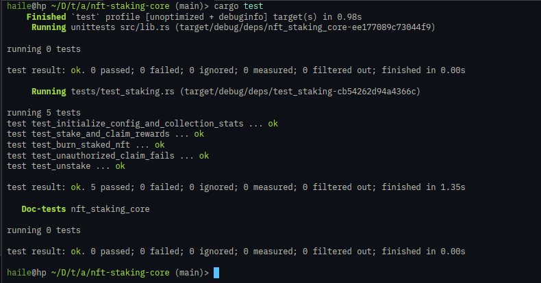

# NFT Staking Core (Metaplex Core)

A non-custodial NFT staking program for Metaplex Core assets on Solana built with Anchor. Implements Core delegate plugins for freeze/burn mechanics, direct reward claiming without unstaking, burn-to-earn bonuses, and collection-level staking counters.

## Architecture

- `StakeConfig` PDA (`[b"config"]`): Stores admin authority, reward mint, reward rate (`points_per_sec`), and `burn_bonus_points`.
- `UserStake` PDA (`[b"stake", asset]`): Tracks staker identity, staked asset address, collection address, initial stake timestamp, and `last_claimed_at`.
- `FreezeDelegate` Plugin: Added to the staked Core asset with `frozen = true` and `stake_config` as the plugin authority to lock transfers while staked.
- `BurnDelegate` Plugin: Added to the staked Core asset with `stake_config` as authority to enable permanent burn-to-earn execution.
- `Attributes` Collection Plugin: Tracks collection-level staking metrics, maintaining a `"total_staked"` counter.

## Instructions

| Instruction | Description |
|-------------|-------------|
| `initialize_config` | Initializes the global `StakeConfig` PDA with reward rate, burn bonus, and reward mint authority. |
| `init_collection_stats` | Attaches the `Attributes` plugin to the Collection account with `"total_staked": "0"` and delegates authority to `stake_config`. |
| `stake` | Adds `FreezeDelegate` (frozen) and `BurnDelegate` to the Core asset, increments collection `"total_staked"`, and creates the `UserStake` account. |
| `claim_rewards` | Collects accumulated rewards without unstaking the NFT, minting reward tokens directly to the user's ATA while keeping the asset frozen. |
| `burn_staked_nft` | Permanently burns the staked NFT via `BurnDelegate` CPI, mints accrued rewards plus a one-time burn bonus to the user's ATA, decrements `"total_staked"`, and closes `UserStake`. |
| `unstake` | Mints accrued rewards to user's ATA, thaws and removes `FreezeDelegate` and `BurnDelegate` plugins, decrements `"total_staked"`, and closes `UserStake`. |

## Tests

Integration tests are written in pure Rust using [LiteSVM](https://github.com/LiteSVM/litesvm) with fixture loading for the Metaplex Core program binary (`mpl_core.so`).

```bash
cargo test
```

### Test Coverage

- `test_initialize_config_and_collection_stats`: Verifies config PDA initialization and collection `"total_staked"` attribute setup.
- `test_stake_and_claim_rewards`: Verifies asset freezing, delegate assignment, collection counter increment, and multi-claim reward distribution without unstaking.
- `test_burn_staked_nft`: Verifies burn-to-earn bonus payout, asset burning, collection counter decrement, and account cleanup.
- `test_unstake`: Verifies accrued rewards payout, thaw and removal of delegate plugins, collection counter decrement, and account closure.
- `test_unauthorized_claim_fails`: Verifies that unauthorized third parties cannot claim rewards on other users' staked NFTs.

### Test Results



## Build

```bash
anchor build
```

Requires Rust, Anchor CLI 1.1.2, and Solana toolchain.
